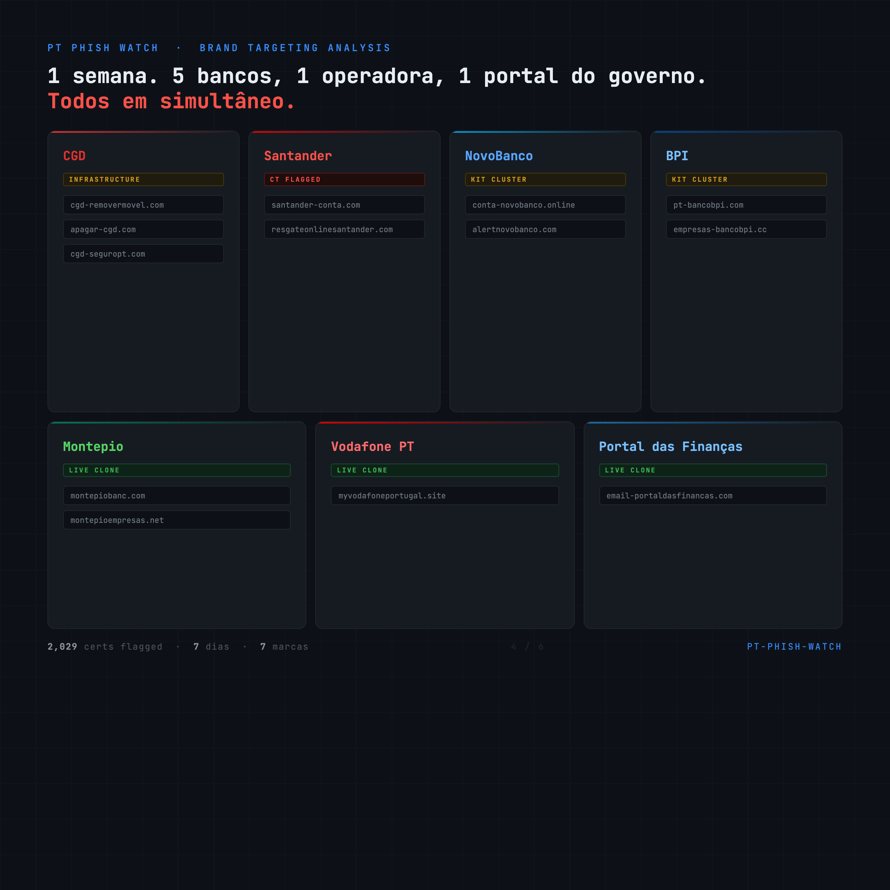
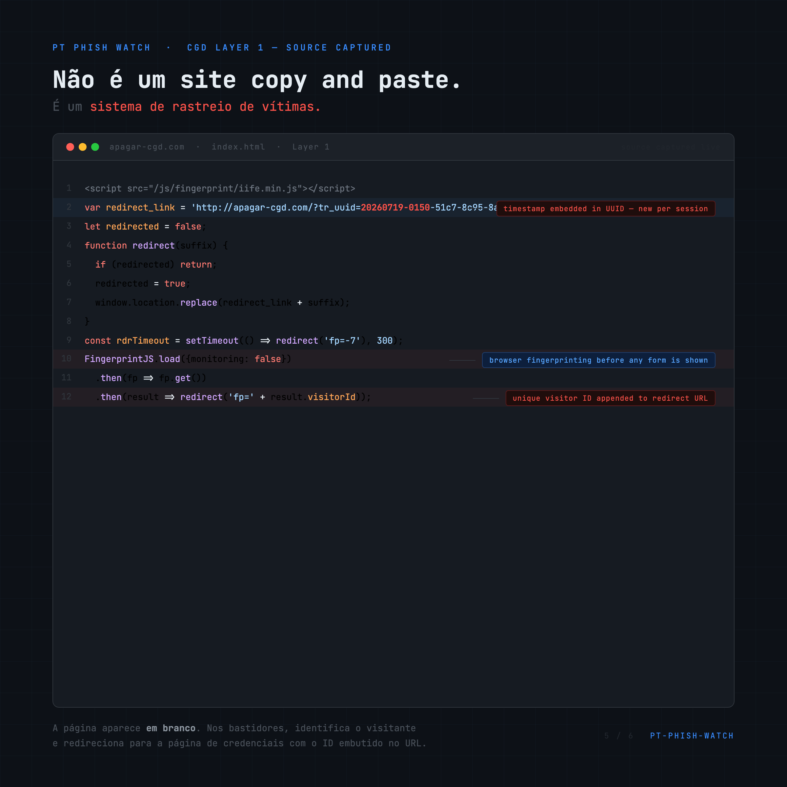
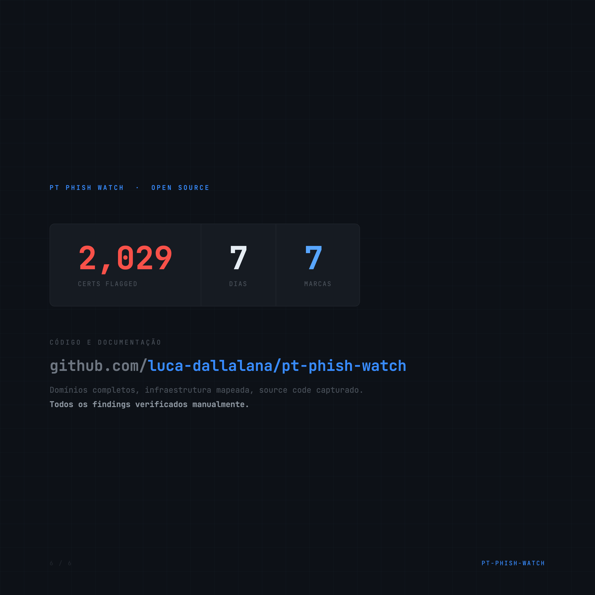
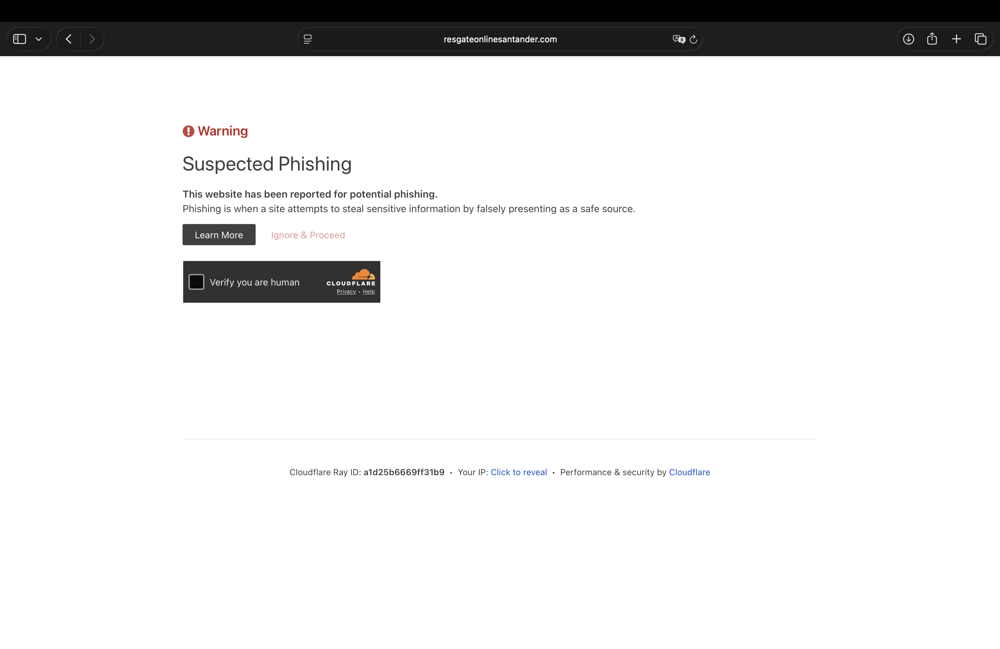
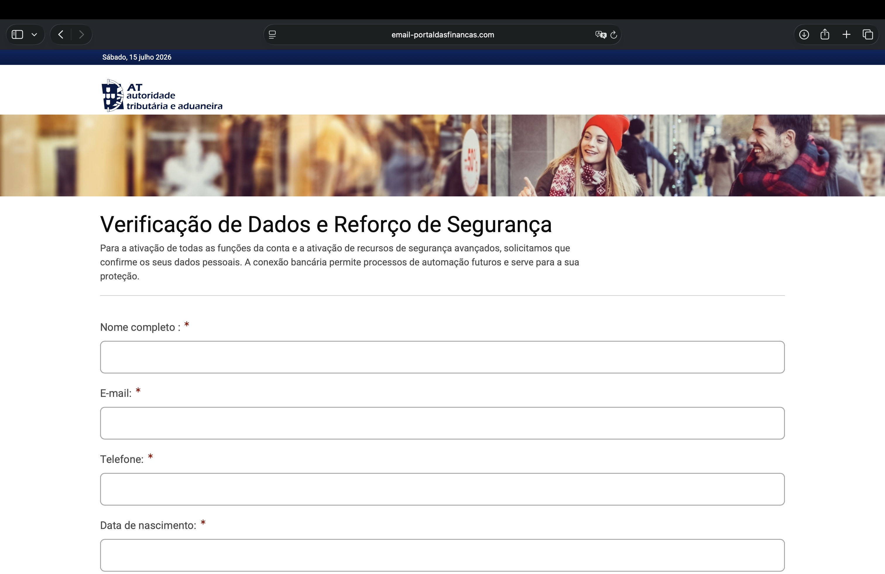

# pt-phish-watch

A Certificate Transparency log monitor that flags domains impersonating Portuguese banks, telecoms, and government services.

CT logs are public. Every TLS certificate issued anywhere in the world is logged in real time. Phishing sites need a certificate to show the browser padlock, the same symbol users rely on to trust a site. By polling the log stream, new phishing infrastructure becomes visible within minutes of deployment.

This repository contains the monitor code and the findings from a 7-day observation window in July 2026.

---

## Visuals

| | |
|---|---|
|  |  |
|  |  |

---

## Architecture

```
CT log (HTTP polling, every 10s, batch 256)
    |
    +-- binary leaf_input parsing
    |       x509_entry and precert_entry
    |       domain extraction from SAN extensions
    |       fingerprint: SHA-256 of raw certificate bytes
    |       validity window, issuer CN
    |
    +-- scoring pipeline (consumer/scoring.py)
    |       1. pre-filter
    |       2. levenshtein (registered domain)
    |       3. homoglyph normalization + levenshtein
    |       4. brand_contains + segment levenshtein
    |       5. keyword accumulation
    |       6. subdomain abuse
    |
    +-- SQLite (findings.db)
            indexed on seen_at, matched_seed, flag_reason
```

Three CT logs are polled concurrently:

```
https://ct.googleapis.com/logs/us1/argon2026h2/
https://ct.googleapis.com/logs/us1/argon2026h1/
https://ct.cloudflare.com/logs/nimbus2026/
```

The last processed index per log is persisted to `ct_state.json` so restarts do not reprocess history.

---

## Scoring pipeline

### Seeds

24 registered domains covering Portuguese banks, payment systems, government portals, and telecoms:

```
cgd.pt              millenniumbcp.pt    novobanco.pt        santander.pt
montepio.pt         bancobpi.pt         abancaportugal.pt   activobank.pt
portaldasfinancas.gov.pt  eportugal.gov.pt  sns.gov.pt      dre.pt
irn.mj.pt          sef.pt              at.gov.pt
mbway.pt           multibanco.pt       ifthenpay.com       eupago.pt
meo.pt             nos.pt              vodafone.pt         nowo.pt
```

### Step 1 — Pre-filter

If the candidate's registered domain is in `SEED_REGISTERED` or `_KNOWN_LEGIT_REGISTERED`, return `None`. The known-legit list covers legitimate Santander subsidiaries (`santanderconsumer.pt`, `gruposantander.com`, etc.), Vodafone event domains (`vodafoneparedesdecoura.pt`), and other recurring false positives documented during the observation window.

### Step 2 — Levenshtein (registered domain level)

For each seed, compute Levenshtein distance between the candidate's registered domain and the seed's registered domain. Adaptive threshold: distance 1 for seeds under 10 characters, distance 1-3 for seeds 10 characters or longer. Excluded seeds: `at.gov.pt` and `sns.gov.pt` (too short or too generic for reliable registered-domain matching; covered by other steps).

`flag_reason: levenshtein`

### Step 3 — Homoglyph normalization

Apply NFKD decomposition, strip combining characters, then substitute known homoglyphs:

| Glyph | Normalised | Script |
|-------|-----------|--------|
| а е о р с х | a e o p c x | Cyrillic |
| ο ρ | o r | Greek |
| ℓ ℬ | l b | Mathematical |

Re-run Levenshtein on the normalised form. Only fires if normalization changed the string.

`flag_reason: homoglyph`

### Step 4 — brand_contains and segment Levenshtein

**brand_contains**: For brands >= 5 characters, substring match within the candidate domain part. `eportugal` requires a word boundary (position 0 or immediately after `-`). Short brands (3-4 characters: `nos`, `sns`, `meo`, `dre`) are excluded from this step due to high false-positive rate as global abbreviations; they remain active via Levenshtein and subdomain steps.

**Santander city disambiguation**: `santander` brand_contains matches are discarded if the candidate's TLD is a non-PT ccTLD and no banking keyword is present. Domains under `.pt` always pass. Banking keyword set for this check extends `KEYWORD_SCORES` with: `cliente`, `online`, `verificar`, `alerta`, `netbanco`, `cuenta`, `banca`, `banking`, `empresa`, `soporte`, `support`, `app`.

**Segment Levenshtein**: For each hyphen-delimited segment of the candidate domain (length >= 4), compute distance 1 against all brands >= 5 characters. Catches transpositions like `sanrtander` or substitutions like `nbway`.

`flag_reason: brand_contains` or `levenshtein`

### Step 5 — Keyword accumulation

Score keywords present anywhere in the full candidate domain:

| Keyword | Score |
|---------|-------|
| mbway | 25 |
| multibanco | 25 |
| seguro | 20 |
| login | 20 |
| conta | 15 |
| acesso | 15 |
| verify | 15 |
| secure | 15 |
| portal | 10 |
| banco | 10 |
| financas | 10 |
| pagamento | 10 |

Threshold: total score > 40.

`flag_reason: keyword`

### Step 6 — Subdomain abuse

Check whether a seed's registered domain appears verbatim as consecutive labels in the candidate (e.g. `cgd.pt.malicious.com`). The subdomain check runs across the full domain, not just the registered portion.

`flag_reason: subdomain`

### Deduplication

Each certificate's SHA-256 fingerprint is tracked in a bounded in-memory set (capacity 10,000, LRU eviction of 1,000 entries). Certificates appearing in multiple CT logs within the same poll cycle are processed once.

---

## Findings — July 2026

**2,029 certificates flagged across 7 days. All findings below were manually verified.**

### CGD — Two-layer victim-tracking infrastructure

Flagged domains:
- `cgd-removermovel.com`
- `apagar-cgd.com`
- `cgd-seguropt.com`

All three domains resolved to a two-layer architecture. Layer 1 source captured from `apagar-cgd.com/index.html`:

```javascript
<script src="/js/fingerprint/iife.min.js"></script>

var redirect_link = 'http://apagar-cgd.com/?tr_uuid=20260719-0150-51c7-8c95-8a620&';
let redirected = false;

function redirect(suffix) {
  if (redirected) return;
  redirected = true;
  window.location.replace(redirect_link + suffix);
}

const rdrTimeout = setTimeout(() => redirect('fp=-7'), 300);

FingerprintJS.load({monitoring: false})
  .then(fp => fp.get())
  .then(result => redirect('fp=' + result.visitorId));
```

The page renders blank. FingerprintJS runs in the background, generates a unique visitor ID, and redirects to Layer 2 with the ID embedded in the URL alongside a timestamp-prefixed UUID (`20260719-0150-...`). The UUID format encodes the session date and time, giving the operator per-victim timestamps without server-side session state.

Layer 2 is the CGD credential harvest form. The visitor ID in the URL allows the operator to correlate the fingerprint profile with the submitted credentials.

### Santander — Deployment pipeline detected

CT logs captured a sequential cert issuance sequence on `santander-conta.com`:

| Subdomain | Classification |
|-----------|---------------|
| `staging.santander-conta.com` | Staging |
| `backend.santander-conta.com` | Backend |
| `portal.santander-conta.com` | Portal |
| `comdemo.santander-conta.com` | Demo |
| `rknyicwl.santander-conta.com` | Live |

Also flagged independently: `resgateonlinesantander.com`.

The live subdomain returned blank pages to all requests during the observation window, both with and without Cloudflare WARP active. The site was either victim-gated at the referrer level or decommissioned. Phishing content was not confirmed. The staging-to-live cert sequence is consistent with a deployment pipeline being caught in progress.

`resgateonlinesantander.com` was independently flagged by Cloudflare's own phishing detection before the observation window closed:



### NovoBanco + BPI — Phishing kit cluster

Flagged domains:
- `conta-novobanco.online`
- `alertnovobanco.com`
- `pt-bancobpi.com`
- `empresas-bancobpi.cc`

All four share an operator fingerprint: credential pages require an HTTP `Referer` header matching `app.?error=404&ref=true&t=<TIMESTAMP>`. Direct requests without this header return HTTP 404. This referrer token is embedded in the phishing link delivered to victims, ensuring the credential form is unreachable to automated scanners and researchers following direct URLs.

**IP correlation:**

| IP | ASN | Org |
|----|-----|-----|
| 185.53.179.136 | AS35415 | Team Internet AG, DE |
| 185.53.179.146 | AS35415 | Team Internet AG, DE |

Both IPs are in the same /24 block and registered to the same AS. The NovoBanco and BPI phishing kit infrastructure ran simultaneously from this block, pointing to a single operator targeting multiple brands from shared hosting.

### Montepio — Live clone

- `montepiobanc.com`: full clone of the Montepio Net24 login page. Rendered the Banco Montepio logo, "Acesso Net24 Particulares" and "Acesso Net24 Empresas" credential forms with continue buttons, and a "Recomendações de Segurança" footer section. Visually indistinguishable from the legitimate site.
- `montepioempresas.net`: variant targeting business account holders.


### Vodafone PT — Live clone

- `myvodafoneportugal.site`: clone of the My Vodafone Portugal portal.


### Portal das Finanças — Live clone

- `email-portaldasfinancas.com`: impersonates the AT (Autoridade Tributária e Aduaneira). Presents a "Verificação de Dados e Reforço de Segurança" page with the official AT logo and a credential form collecting full name, email, phone number, and date of birth. The site displayed the date of the visit in the header, making it appear dynamic and recently maintained.



---

## WARP detection

Sites in the NovoBanco/BPI cluster and the Santander live subdomain detected connections from security tooling. The detection mechanism checked the IP metadata of incoming requests (via an IP intelligence API). When the connecting IP resolved to an ASN or organization associated with security tooling (including `org=Cloudflare WARP`), the site returned a blank page. Switching to a residential IP did not consistently expose content on already victim-gated pages where the referrer token was also required.

---

## Running

```bash
cp .env.example .env
docker compose up -d
```

Findings are written to `./data/findings.db` on the host. The volume mount in `docker-compose.yml` maps `./data` to `/data` inside the container.

```bash
# Follow logs
docker compose logs -f consumer

# Query findings
sqlite3 data/findings.db \
  "SELECT candidate_domain, flag_reason, matched_seed, datetime(seen_at, 'unixepoch') \
   FROM flagged_certs ORDER BY seen_at DESC LIMIT 20;"
```

Environment variables (`.env.example`):

```
DB_PATH=/data/findings.db
STATE_PATH=/data/ct_state.json
LOG_LEVEL=INFO
POLL_INTERVAL=10
```

## Tests

```bash
cd consumer
python -m pytest tests/test_scoring.py -v
```

Tests run fully offline against the scoring pipeline. Coverage includes: pre-filter, Levenshtein, homoglyph, brand_contains, segment Levenshtein, keyword threshold, subdomain abuse, known-legit bypass, Santander city disambiguation, and fingerprint deduplication.

---

## Schema

```sql
CREATE TABLE flagged_certs (
    id               INTEGER PRIMARY KEY AUTOINCREMENT,
    candidate_domain TEXT    NOT NULL,
    matched_seed     TEXT    NOT NULL,
    flag_reason      TEXT    NOT NULL,   -- levenshtein | homoglyph | brand_contains | keyword | subdomain
    score            INTEGER NOT NULL,   -- keyword score; 0 for distance-based flags
    edit_distance    INTEGER,            -- null for brand_contains, keyword, subdomain
    issuer           TEXT,
    not_before       INTEGER,            -- unix timestamp
    not_after        INTEGER,            -- unix timestamp
    seen_at          INTEGER NOT NULL,   -- CT log entry timestamp (unix)
    fingerprint      TEXT    NOT NULL UNIQUE,
    created_at       INTEGER NOT NULL DEFAULT (unixepoch())
);
```
